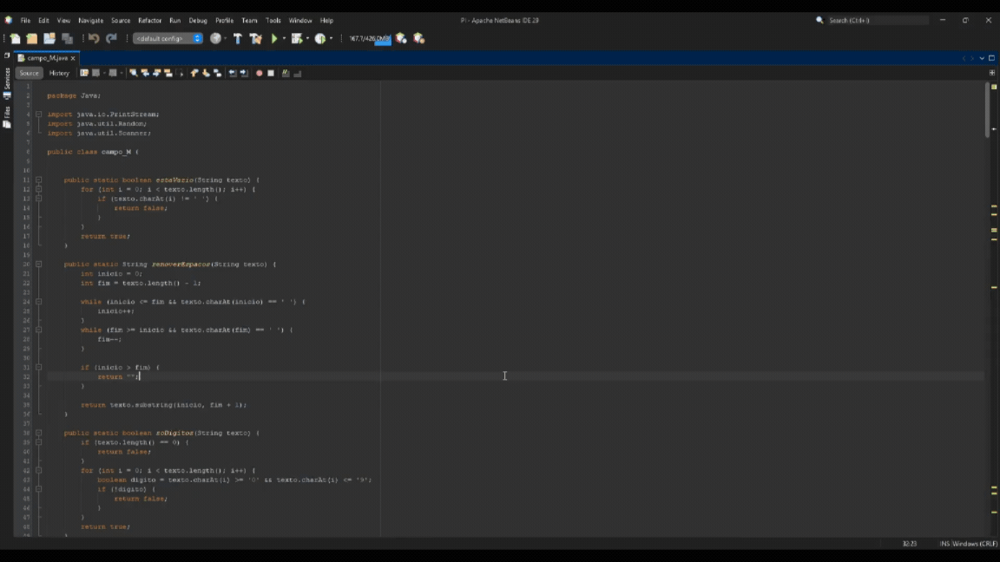

# 💣 Campo Minado — Java Console

Jogo Campo Minado para terminal desenvolvido em Java puro, sem bibliotecas externas.

## 🎬 Demo



## 🎮 Como jogar

1. Escolha a dificuldade:
   - **Fácil** → grade 6×6, 8 bombas
   - **Médio** → grade 9×9, 16 bombas
   - **Difícil** → grade 12×12, 22 bombas
2. Informe linha e coluna para revelar uma célula
3. O número exibido indica quantas bombas existem nas células vizinhas
4. Revele todas as células sem bomba para vencer!

## ▶️ Como executar

### Pelo NetBeans
1. `File → Open Project` e selecione a pasta do projeto
2. Pressione `F6` para compilar e rodar

### Pelo terminal
```bash
# Compilar
javac -d out src/main/java/campoMinado/Campo.java

# Executar
java -cp out campoMinado.Campo
```

## 🗂️ Estrutura do projeto

```
campoMinado/
├── src/
│   └── main/
│       └── java/
│           └── campoMinado/
│               └── Campo.java
├── demo.gif
├── .gitignore
└── README.md
```

## 👤 Autor

Kauã Carreiro Costa — Análise e Desenvolvimento de Sistemas
